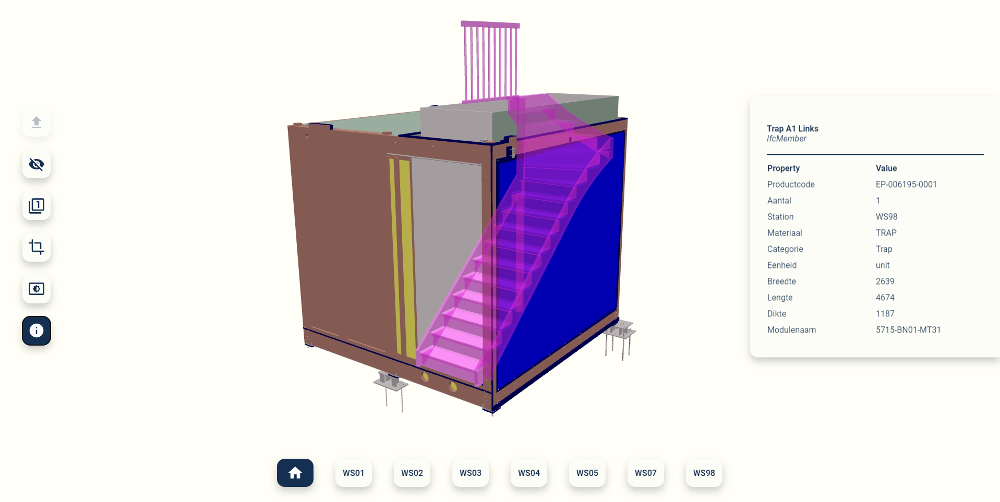

## IFC web viewer focused on custom property sets, using [IFC.js](https://ifcjs.github.io/info/) and [Svelte](https://svelte.dev/).

## Description
Simple IFC viewer with the ability to select the parts which need to be assembled, per workstation. As this is set in a custom property set, this can be adjusted to filter on a different custom property.

 

## Getting Started

### Dependencies

This app is built using `web-ifc-viewer`, which depends on `web-ifc-three`, `web-ifc`, and `three`.

### Contents

- `src/App.svelte`: IFC viewer and the logic behind it
- `public/global.css`: Styling of the viewer

### Functionalities and future implementations

- [x] IFC viewer: geometry and data
- [x] Creating subsets based on custom property
- [x] Isolating an element
- [x] Hiding one/multiple element(s), even on subsets
- [x] 3D clipping planes
- [x] Showing transparent elements of previous workstations
- [x] Custom Property menu: only gives select, necessary information from a custom pset

- [ ] Extracting functions to create components for maintainability
- [ ] Considering adding a Tree view
- [ ] Ability to select path for custom properties
- [ ] Adding mapbox integration
- [ ] Changing styling

## Authors

Stijn Nijhuis
[@Nomeon](https://www.linkedin.com/in/stijn-nijhuis-56593524a/)

## Version History

- 0.1
  - Initial Release

## Acknowledgments

Inspiration, code snippets, etc.

- [IFC.js](https://ifcjs.github.io/info/)
- [Francesca's viewer](https://github.com/duffra/BIMexp_o)
